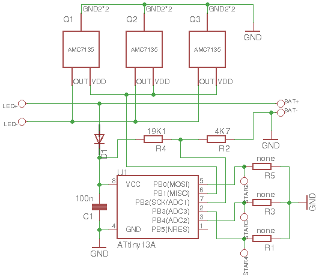

# Flashlight
A firmware for a flashlight driver based on ATtiny13A.
Public domain - see file UNLICENSE

## Hardware
Designed for power button (not tact one) and one Li-Ion cell. Should work with ATtiny45 and ATtiny85, but untested.

- PB0 - one AMC7135
- PB1 - two AMC7135's
- PB2 - devider 19k1 and 4k7 between VCC and GND (for battery monitoring); you can calibrate monitoring for other values (see below)
- PB4 - resistor 1M and then ceramic capacitor 1u to GND (for off-time measurement)

*Note:* well-known AK-47A driver can be easily modified for this schematic. Just cut connection to Q3 and connect it with pin 5 (PB0) and solder R6+C2.

## Handling
For main modes: 3.5mA, 0.35A, 0.7A, 1.05A. Quick off-on (half-click) to switch to next mode. Remembers last selected mode.

Quick double off-on to go to special modes: beacon, strobe and SOS. Quick double off-on again to return to main modes loop.

Will go to 0.35A mode automatically and blink periodically if battery is low (< 3.5V), then go to minimum mode (< 3.2V) and later power off when battery is empty (< 3.0V). Exact voltage may vary for different chips.

## Calibration
You can define your own battery low and empty levels, if you recompile the firmware with `ENABLE_CALIBRATION=1` (for ATtiny13A you have to temporarily disable all other features), then:
1. Switch the flashlight off.
2. Short PB2 to GND, to calibrate the battery empty level.
3. Switch the flashlight on, it will start to blink.
4. Release the PB2, flashlight will blink slower.
5. Switch the flashlight off
6. Short PB2 to VCC, to calibrate battery minimum, low level and the correction.
7. Repeat steps 3-5.
8. Calibration is complete.

Or write directly into EEPROM:
> @0x00: empty battery level
> @0x01: minimum battery level
> @0x02: low battery level
> @0x03: correction for a 0.35 A-current
Or just define your default values in code.

## Programming
Fuses (avrdude format):
> -U lfuse:w:0x3a:m -U hfuse:w:0xff:m

## Debugging
Set `ENABLE_UART=1` (for ATtiny13A you have to temporarily disable all other features), recompile and see the signal on PB3 (pin 2). 115200 baud.